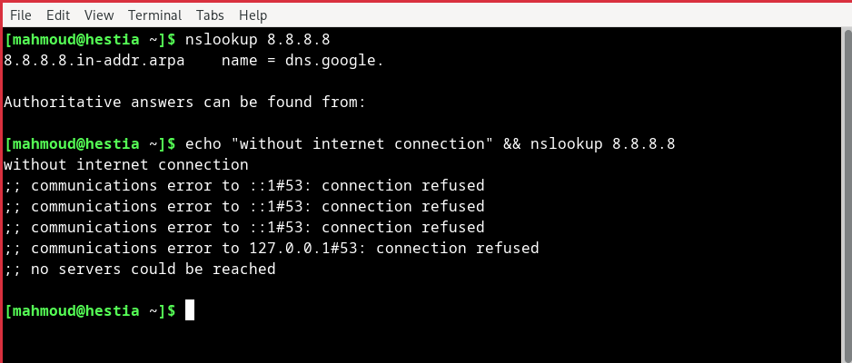
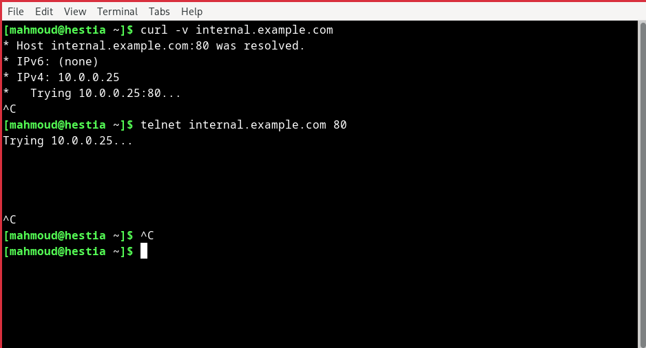
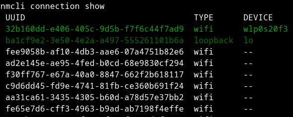

## Q2 : **Scenario**

Your internal web dashboard (hosted on `internal.example.com`) is suddenly unreachable from multiple systems.
The service seems up, but users get “host not found” errors.
You suspect a DNS or network misconfiguration. Your task is to troubleshoot, verify, and restore connectivity to the internal service.
  
**🛠️ Your Task:**
### 1.  Verify DNS Resolution:
Compare resolution from /etc/resolv.conf DNS vs. `8.8.8.8`.\

The /etc/resolv.conf file is a file that exists at linux and unix machines, and this dns address is owned by Google, it's fast and reliable\
It tell us how does my computer resolve domains and which dns provider does it use


So, this could be the root cause if:
 1. we found another dns provider at this file and this provider is not providing our server\
 2. we found a completely wrong dns provider address\
 3. i think this dns server could be fail i know that this is so a super far scenario but it may happen so if we check the /etc/resolve.conf then found it 8.8.8.8, which is correct, then we have to lookup on the dns server

How to fix it:
  by correcting the /etc/resolv.conf file with the correct dns `8.8.8.8`



### 2.  Diagnose Service Reachability:
Confirm whether the web service (port 80 or 443) is reachable on the resolved IP.
Use curl, telnet, netstat, or ss to find if the service is listening and responding.

acctually at many times this is the most common problem, so this could be the root problem if:
1. if we aren't on the same network like if we are on a vpn or cloud
2. the firewall or se-linux of the server is blocking the traffic on this port
3. the certificate of the proided service is self-signed (this could lead to minor problems with the browser)
4. the internal load balancer (proxy) is not forwarding the traffic as it should be
5. the web server is not running well or being inactive on the server
6. the security group is denying the 80, 443 ports to work (if we are on the cloud)
7. we're being forwarding to a broken service
8. the server is running but there's a high latency (because of some trouble on the server)


How to fix it: 
1. (different network) --> making sure that we're on the same network `ip -a`
2. (firewall) --> by allowing the traffic to reach this port
`se-linux`
```bash
sestatus # to check the current se linux status
sudo semanage port -a -t http_port_t -p tcp 8080 #(.ex) if allowing a service to bind to a port 
sudo ufw allow 80, 443 # allowing for these port to work
```
3. try using different browser. `(firefox, brave, chrome)`
4. by ssh-ing on the load balancer then modify the web server configuration, also using `traceroute`
to trace the packets
```bash
traceroute google.com
traceroute internal.example.com
```
5. activating the service and making sure it's running
```bash
sudo systemctl status nginx # OR
sudo service nginx start
```
6. using `curl` command to check if can get a response or not
```bash
curl internal.example.com
curl -vk internal.example.com # for https
```
7. we can also use `telnet` command to try accessing the server and making sure there's a connection
```bash
telnet google.com 80, 443
```


### 3.  Trace the Issue – List All Possible Causes
**🧪** Your goal here is to identify and list all potential reasons why [internal.example.com](http://internal.example.com/) might be unreachable, even if the service is up and running. Consider both DNS and network/service layers.
1. **DNS**
  - incorrect dns records
  - dns cached & dns server issue 
  - dns high latency
  - dns resolver misconfiguration
  - dns ttl(time to live) issue
  - internal dns issue
2. **Network Issue**
  - firewall or security group rules
  - network isolation
  - route table misconfiguration
3. **Service**
  - service endpoint misconfiguration
  - service ip changed (but not updated at the dns resolver)
  - service fail to be active
  - server side issue
  - caching or proxy issue

### 4.  Propose and Apply Fixes
✅ For each potential issue you identified in Point 3, do the following:
1.  Explain how you would confirm it's the actual root cause
2.  Show the exact Linux command(s) you would use to fix it
  
**🧠** **Note:**
Please include screenshots that demonstrate how you identified and resolved the issue 
  
**🏆 Bonus:**
Configure a local /etc/hosts entry to bypass DNS for testing.
Show how to persist DNS server settings using systemd-resolved or NetworkManager.

first if we tried to use curl or telnet on `internal.example.com` it will fail\
but 
```bash
sudo nvim /etc/hosts
# then adding the next line in it
10.0.0.25 internal.example.com
```

then try to use `curl` or `telnet`


persist dns server settings using nmcli
```bash
nmcli connection show # to list all the previous made connection & also to get the current connection
```


then, to modify the connection to use a custom dns
```bash
sudo nmcli connection modify <connection-device-name> ipv4.dns "8.8.8.8 33.33.33.33" #(.ex)
# then you would need to restart the nmcli to apply the changes

sudo nmcli connection down <connection-name>
sudo nmcli connection up <connection-name>
# then show the current info about the device
nmcli device show <connection-device-name>
```


